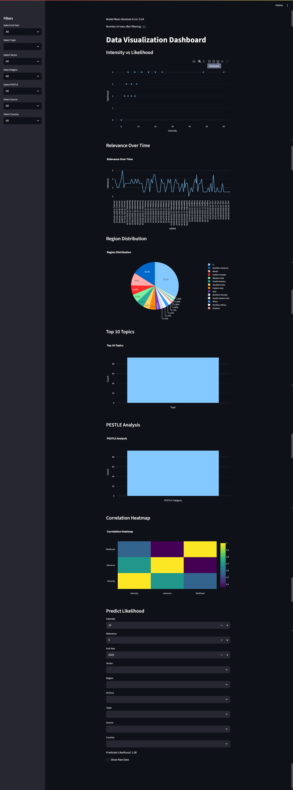

# Data Visualization Dashboard

A comprehensive data visualization dashboard built with Streamlit that provides interactive insights into environmental and social data. The dashboard includes various visualizations and a machine learning model for predicting likelihood based on different factors.

## Features

### Data Visualizations
- **Intensity vs Likelihood Scatter Plot**: Visualizes the relationship between intensity and likelihood of events, colored by topic.
- **Relevance Over Time Line Plot**: Shows how relevance changes over time for different topics.
- **Region Distribution Pie Chart**: Displays the distribution of data across different regions.
- **Top 10 Topics Bar Chart**: Highlights the most frequently occurring topics in the dataset.
- **PESTLE Analysis Bar Chart**: Provides insights into PESTLE (Political, Economic, Social, Technological, Legal, Environmental) categories.
- **Correlation Heatmap**: Shows the correlation between numerical variables in the dataset.

### Machine Learning Model
- **Random Forest Regressor**: Predicts the likelihood of events based on various features including intensity, relevance, end year, sector, region, PESTLE category, topic, source, and country.
- **Model Evaluation**: Displays the Mean Absolute Error (MAE) of the prediction model.

### Interactive Filters
- **End Year Filter**: Filter data by specific years.
- **Topic Filter**: Select specific topics of interest.
- **Sector Filter**: Filter by different sectors.
- **Region Filter**: Focus on specific geographical regions.
- **PESTLE Filter**: Filter by PESTLE categories.
- **Source Filter**: Select data from specific sources.
- **Country Filter**: Filter by country.

### Prediction Interface
- **Input Parameters**: Users can input various parameters to predict the likelihood of an event.
- **Real-time Prediction**: The model provides immediate predictions based on user inputs.

## Installation

1. Clone the repository:
   ```bash
   git clone https://github.com/vineetvedant/Data_Visualisation.git
   cd Data_Visualisation
   ```

2. Install the required dependencies:
   ```bash
   pip install streamlit pandas plotly scikit-learn numpy
   ```

3. Run the application:
   ```bash
   streamlit run tt.py
   ```
   Or if `streamlit` is not recognized:
   ```bash
   python -m streamlit run tt.py
   ```

## Usage

1. After running the application, open your web browser and navigate to `http://localhost:8501`.
2. Use the sidebar filters to narrow down the data based on your interests.
3. Explore the various visualizations to understand the data patterns.
4. Use the prediction section to input parameters and get likelihood predictions.
5. Check the "Show Raw Data" box to view the underlying dataset.

### Dashboard Preview

Below is a screenshot of the dashboard in action:



## Data

The application uses a JSON file (`jsondata.json`) as its data source. The dataset contains information about various environmental and social events with attributes such as:
- Title
- Intensity
- Relevance
- Likelihood
- End year
- Topic
- Sector
- Region
- PESTLE category
- Source
- Country
- Added date

## Dependencies

- Streamlit: For creating the web application interface
- Pandas: For data manipulation and analysis
- Plotly: For creating interactive visualizations
- Scikit-learn: For the machine learning model
- NumPy: For numerical operations

## Project Structure

```
Data_Visualisation/
├── tt.py              # Main application script
├── jsondata.json      # Dataset in JSON format
├── LICENSE            # License file
└── README.md          # This file
```

## License

This project is licensed under the MIT License. See the [LICENSE](LICENSE) file for details.

## Author

[Vineet Vedant](https://github.com/vineetvedant)

## Contributing

Contributions are welcome! Please feel free to submit a Pull Request.

## Acknowledgments

- Streamlit for the excellent web application framework
- Plotly for the interactive visualization library
- Scikit-learn for the machine learning capabilities
- Pandas for data manipulation
